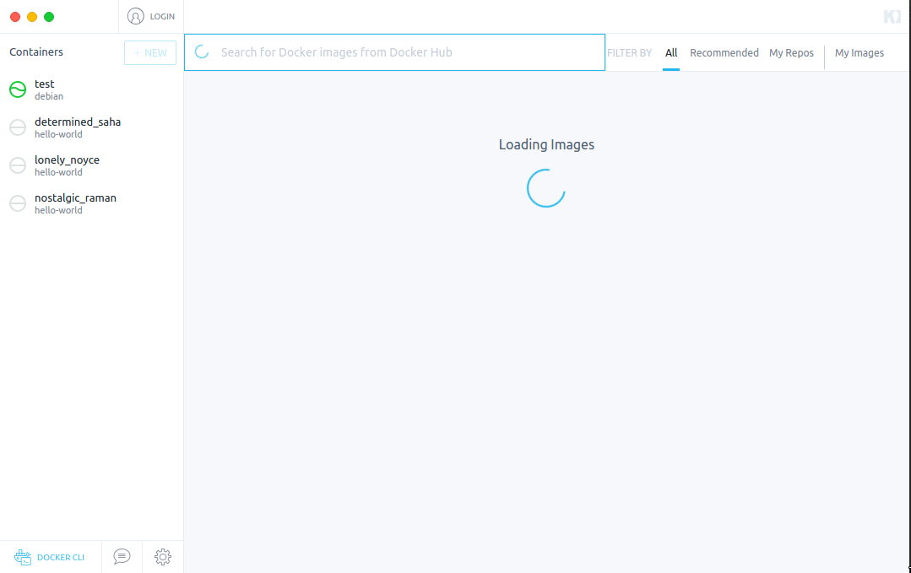
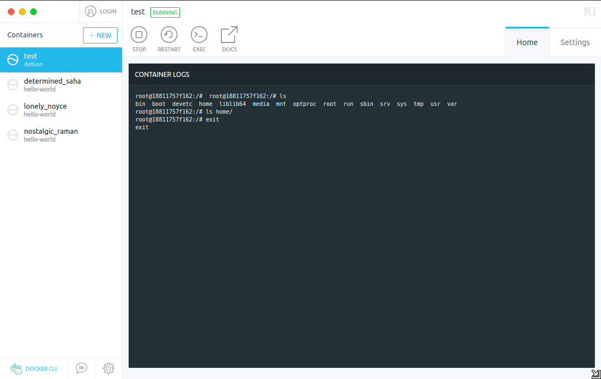
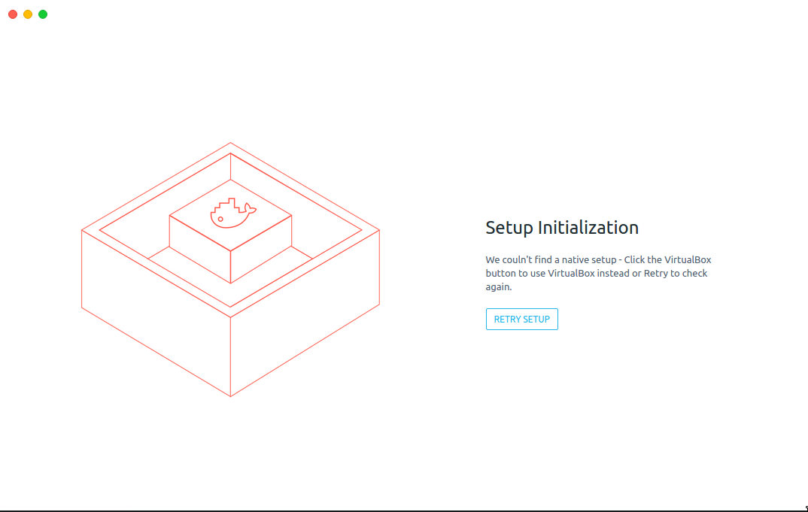

# How to install kitematic on Linux

## Ubuntu

Download the Ubuntu package (Kitematic-X.X.X-Ubuntu.zip) from the [release page](https://github.com/docker/kitematic/releases/). 

Assuming that you are already in the right directory extract the archive and 
install kitematic issuing the following command:

```
$ sudo dpkg -i ./Kitematic_X.X.X_amd64.deb
```

where ```X.X.X``` indicates the extracted package version (i.e.: Kitematic_```0.13.0```_amd64.deb).

After the installation is complete, if Docker is already configured, kitematic 
can be launched (otherwise follow the [Post-installation steps for Linux](#post-installation-steps-for-linux) ):

The following images show the start up sequence of kitematic when issuing the 
```$ kitematic``` command.

### kitematic starting


### kitematic loading images



### kitematic listing images


### kitematic showing a container log



## Arch

kitematic and kitematic-git (also docker-bin and docker-git) are available in AUR.
Assuming that Docker and relative missing dependencies are already installed, 
install the preferred kitematic version and follow the [Post-installation steps for Linux](#post-installation-steps-for-linux) 
section if needed.

ArchWiki [Docker](https://wiki.archlinux.org/index.php/Docker) documentation.

## Post installation steps for Linux

```
$ sudo groupadd docker

$ sudo gpasswd -a ${USER} docker

$ sudo service docker restart
```

To activate the changes to docker group either do a ```$ newgrp docker```, in 
this case you will be able to properly run kitematic only from terminal 
otherwise you will receive the following message:



or log out/in (in this case you will then be able to run kitematic from 
terminal, graphical menu, etc).

## Troubleshooting

If necessary, try to log out/in (or even reboot).

## x-terminal-emulator does not exist?
Check the [Early Linux Support](https://github.com/docker/kitematic/wiki/Early-Linux-Support) 
documentation.

## A couple useful links for post-installation steps for Linux:

[Post-installation steps for Linux](https://docs.docker.com/engine/installation/linux/linux-postinstall/#/manage-docker-as-a-non-root-user)

and

[How can I use docker without sudo?](http://askubuntu.com/questions/477551/how-can-i-use-docker-without-sudo)

for the ```newgrp docker``` useful tip.
